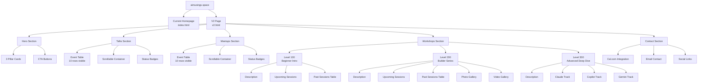
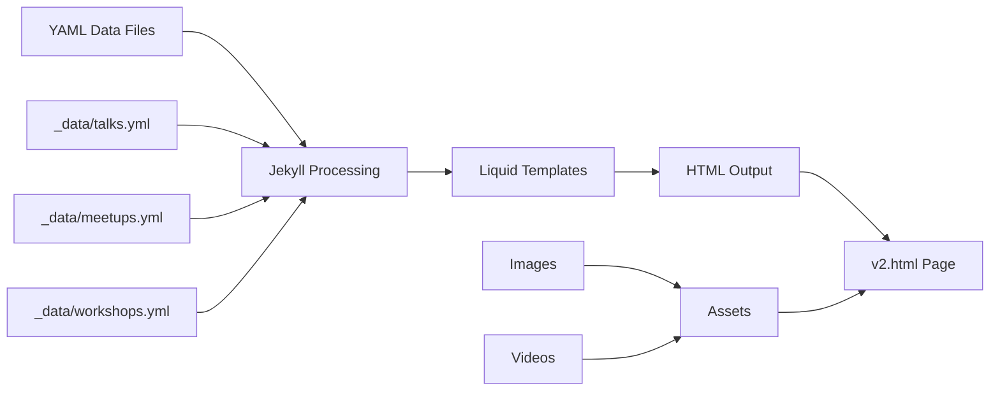
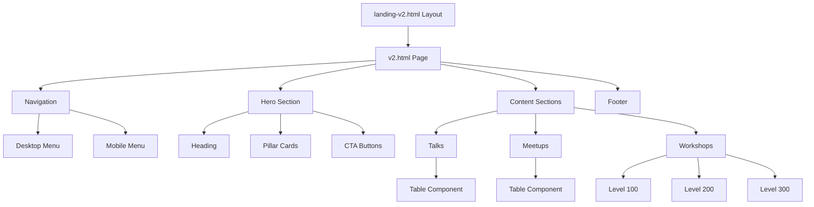
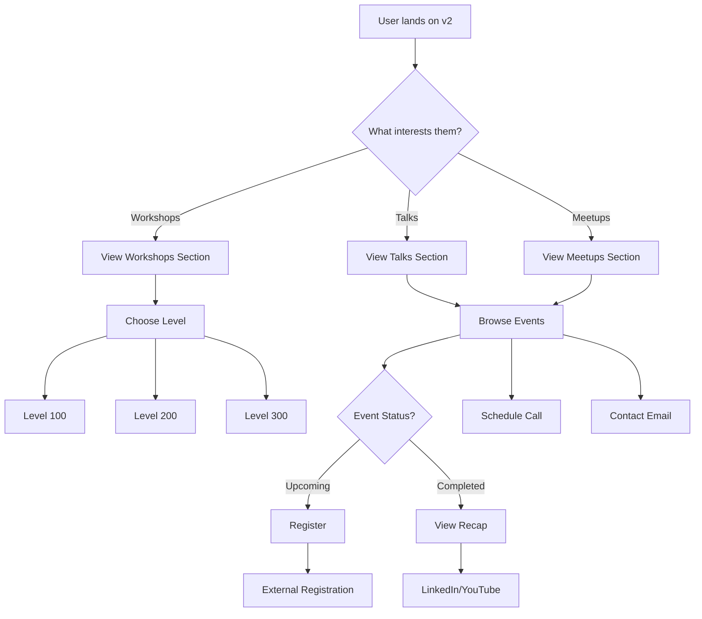
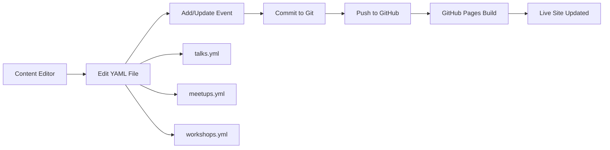
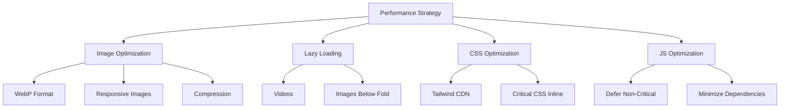
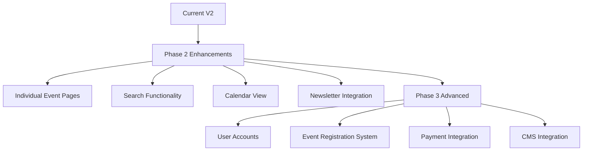
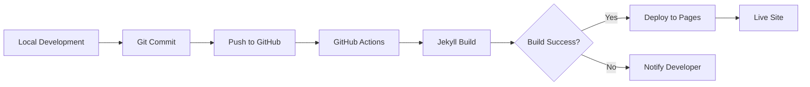

# AIMusings.site V2 - Site Architecture

## Visual Site Map



## Data Flow Architecture



## Component Hierarchy



## Responsive Breakpoints

```
Desktop (1024px+)
├── 3-column pillar cards
├── Full-width tables
├── Side-by-side content
└── Desktop navigation

Tablet (768px - 1023px)
├── 2-column pillar cards
├── Scrollable tables
├── Stacked content
└── Desktop navigation

Mobile (<768px)
├── 1-column pillar cards
├── Card-based tables
├── Fully stacked content
└── Hamburger menu
```

## User Journey Flow



## Content Update Workflow



## File Structure

```
aimusings.site/
│
├── index.html                    # Current homepage (unchanged)
├── v2.html                       # NEW: V2 landing page
│
├── _layouts/
│   ├── default.html              # Existing layout
│   ├── landing.html              # Existing layout
│   └── landing-v2.html           # NEW: V2 layout
│
├── _data/                        # NEW: Data directory
│   ├── talks.yml                 # Talks events data
│   ├── meetups.yml               # Meetups events data
│   └── workshops.yml             # Workshops events data
│
├── _includes/
│   ├── head.html                 # Existing
│   ├── header.html               # Existing
│   └── footer.html               # Existing
│
├── assets/
│   ├── css/
│   │   └── main.scss             # Existing styles
│   ├── js/
│   │   ├── main.js               # Existing scripts
│   │   └── enhanced-interactions.js
│   └── images/
│       ├── talks/                # NEW: Talks photos
│       ├── meetups/              # NEW: Meetups photos
│       └── workshops/
│           ├── level-100/        # NEW: Level 100 photos
│           ├── level-200/        # Existing photos
│           └── level-300/        # NEW: Level 300 photos
│
└── docs/
    ├── V2_IMPLEMENTATION_PLAN.md # This plan
    ├── V2_SITE_ARCHITECTURE.md   # This document
    └── CONTENT_EDITING_GUIDE.md  # To be created
```

## Technology Stack

```
Frontend:
├── HTML5
├── Tailwind CSS (via CDN)
├── JavaScript (Vanilla)
└── Lucide Icons

Backend:
├── Jekyll (Static Site Generator)
├── Liquid (Templating)
└── YAML (Data Storage)

Hosting:
└── GitHub Pages

Integrations:
├── Cal.com (Scheduling)
├── YouTube (Videos)
└── LinkedIn (Social)
```

## Performance Optimization



## Security Considerations

```
1. External Links
   └── target="_blank" + rel="noopener noreferrer"

2. Form Submissions
   └── Cal.com handles security

3. Content Security
   └── YAML validation before deployment

4. HTTPS
   └── Enforced by GitHub Pages

5. No User Input
   └── Static site = minimal attack surface
```

## Accessibility Features

```
WCAG 2.1 AA Compliance:
├── Semantic HTML
├── ARIA labels
├── Keyboard navigation
├── Focus indicators
├── Color contrast (4.5:1 minimum)
├── Alt text for images
├── Skip to content link
└── Responsive text sizing
```

## Analytics & Tracking

```
Metrics to Track:
├── Page views (v2 vs current)
├── Section engagement (Talks/Meetups/Workshops)
├── Registration click-through rate
├── Mobile vs Desktop usage
├── Scroll depth
└── Time on page
```

## Future Scalability



## Deployment Pipeline



## Browser Support Matrix

```
Fully Supported:
├── Chrome 90+
├── Firefox 88+
├── Safari 14+
├── Edge 90+
├── Mobile Safari 14+
└── Mobile Chrome 90+

Graceful Degradation:
├── IE 11 (basic functionality)
└── Older browsers (no animations)
```

## Content Management Roles

```
Role: Content Editor
├── Add new events
├── Update event status
├── Add recap links
└── Upload photos

Role: Developer
├── Update layouts
├── Add new features
├── Performance optimization
└── Bug fixes

Role: Designer
├── Visual updates
├── Brand consistency
└── UX improvements
```

---

## Quick Reference: Key URLs

- **Current Site**: https://aimusings.space
- **V2 Page**: https://aimusings.space/v2
- **Cal.com**: https://cal.com/sree.pradhip
- **Email**: spradhip@pulsarventures.io
- **YouTube**: https://www.youtube.com/@AIMusingsBuilderCommunitySnS
- **WhatsApp**: https://chat.whatsapp.com/GRydfVAJke8AKdnKHFohnS

---

## Quick Reference: Color Codes

- **Brand Purple**: `#7c3aed`
- **Light Purple**: `#8b5cf6`
- **Success Green**: `#10b981`
- **Info Blue**: `#3b82f6`
- **Warning Orange**: `#f59e0b`

---

## Quick Reference: Status Badges

- 🎤 **Upcoming Talk**
- 🤝 **Upcoming Meetup**
- 📅 **Scheduled Workshop**
- ✓ **Completed**
- ❌ **Cancelled**
- 🎯 **Special Session**

---

This architecture document provides a visual and structural overview of the V2 implementation. Use it alongside the Implementation Plan for complete project understanding.